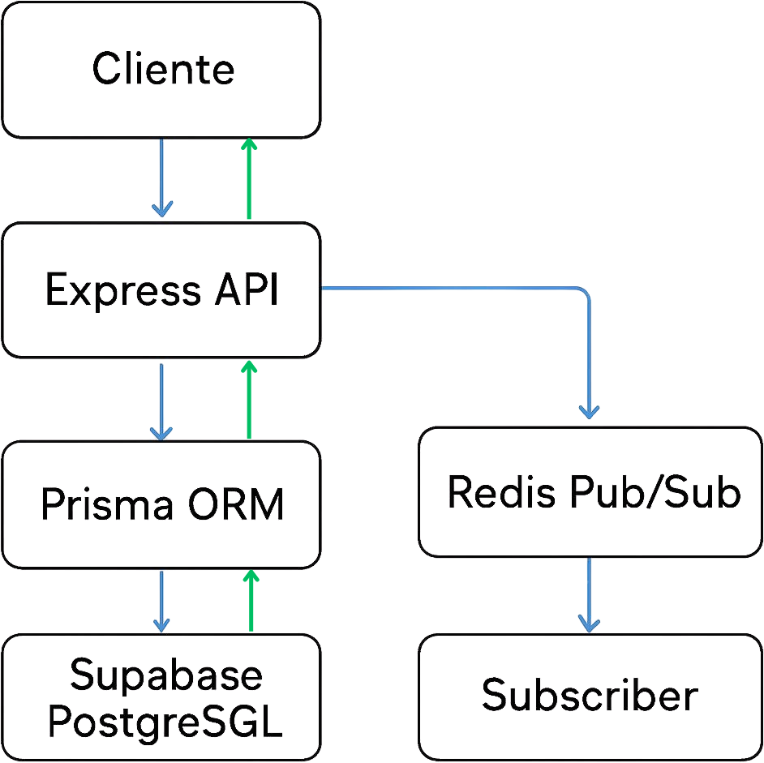

# StudySync API

API REST para gestionar grupos de estudio.
Backend académico desarrollado con Node.js, Express, Prisma, Supabase y Redis Pub/Sub.

## Tecnologías

- Node.js
- Express
- Prisma ORM
- PostgreSQL (Supabase)
- Redis Pub/Sub (Upstash)
- Swagger
- Render

## Arquitectura del sistema



## Explicación de arquitectura

El cliente realiza peticiones HTTP hacia la API desarrollada en Express.

La API utiliza Prisma ORM para interactuar con PostgreSQL alojado en Supabase.

Cuando se crea un nuevo grupo, la API publica un evento en Redis utilizando el patrón Pub/Sub.

El Subscriber escucha los eventos en tiempo real y muestra información en consola.

El proyecto está desplegado en Render.

## Instalación

Clonar repositorio:

```bash
git clone https://github.com/percypj064/studysync-api.git

npm install

PORT=3000
DATABASE_URL=...
REDIS_URL=...

npm run dev


---

# 6. Endpoints

```md id="6ln0cs"
## Endpoints principales

| Método | Endpoint | Descripción |
| GET | /api/grupos | Obtener grupos |
| GET | /api/grupos/:id | Obtener grupo por ID |
| POST | /api/grupos | Crear grupo |
| PUT | /api/grupos/:id | Actualizar grupo |
| DELETE | /api/grupos/:id | Eliminar grupo |

## Swagger

Documentación disponible en:

https://studysync-api-dul1.onrender.com/api-docs

## Redis Pub/Sub

Cuando se crea un grupo mediante POST, el sistema publica automáticamente un evento en Redis.

El Subscriber escucha eventos usando el patrón:

study:*

## Deploy

Aplicación desplegada en Render:

https://studysync-api-dul1.onrender.com

## Integrantes

- Percy Pereyra
- Aaron Ferreira

## Ejecutar proyecto

```bash
npm install
npm start
node src/redis/subscriber.js
```
## URL Producción

https://studysync-api-dul1.onrender.com/api/grupos
